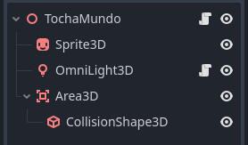
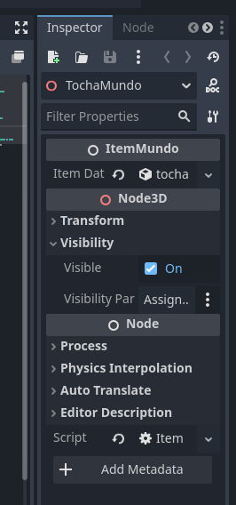
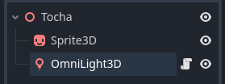
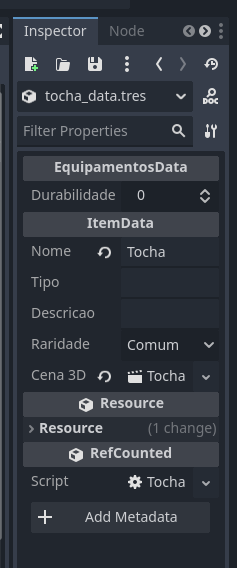

# SISTEMA DE ITENS E COMO CRIAR UM

## 1 - Introdução

A ideia aqui é apresentar a estrutura atual que estamos usando de itens e como criar um item novo, caso você precise — e vai precisar.

## 2 - Estrutura de pastas e o que cada uma faz.

```
📁 Itens/
├── 📁 Cenas/
│   ├── 📁 CenasMapa/

│   └── 📁 CenasMaoJogador/

├── 📁 Equipamentos/
│   ├── 📁 Armas/

│   ├── 📁 Armaduras/
│   │
│   ├── 📁 Ferramentas/

├── 📄 ItemData.gd
└── 📄 ItemMundo.gd
```

Por enquanto, a estrutura de pastas está assim, e acho que está em um bom caminho.

### 2.1 - O que cada pasta/arquivo faz

```
📁 Itens/
```

Essa é a pasta principal e, obviamente, é a pasta onde vamos guardar tudo que tem a ver com itens.

```
├── 📁 Cenas/
│   ├── 📁 CenasMapa/

│   └── 📁 CenasMaoJogador/
```

Essa estrutura de pastas vai guardar as cenas que temos.

Isso é:

CenasMapa — É a cena do item no mapa. Ela guarda Area3D, CollisionShape (se tiver), o script ItemMundo, que será abordado à frente.

CenasMaoJogador — É onde vamos guardar as cenas do mesmo item, só que a cena que é um Node3D com um Sprite3D e, possivelmente, algum script do item, que controla algo que o item faça, por exemplo, a tocha que tem a Omnilight3D e o script da luz, para fazer piscar.

Esses nós que fazem parte do item, os scripts deles e que funcionam na mão do jogador — como a luz piscando — ficam na cena que está nessa pasta.

Resumindo: os itens que ficam no mundo vão ter a cena na pasta itens mundo. Quando pegarmos o item do mundo, vamos instanciar a cena item mão (que fica na outra pasta) na mão do jogador.

Sempre que pegarmos o item do inventário, é a cena item mão que vamos instanciar na mão.

```
├── 📁 Equipamentos/
│   ├── 📁 Armas/

│   ├── 📁 Armaduras/
│   │
│   ├── 📁 Ferramentas/
```

Essa parte é onde vão ficar as datas de cada item.

Primeiro, vamos definir o que é data.

Data é um script que não tem métodos; ele serve apenas para guardar variáveis e, com ele, geramos o .tres.

Que é o arquivo em que colocamos esses dados, que são os valores dessas variáveis, pelo inspetor.

Isso também vai ser explicado mais à frente.

Nessas pastas, vamos ter os scripts que precisamos para cada item.

Ou seja, dentro de Ferramentas vamos encontrar a pasta Tocha, e dentro vamos ter:

* Script da luz ou algum script que controle uma propriedade do item. Ex: Armas que aplicam veneno vão ter um script que lê o ataque do jogador e aplica o veneno.  
Esse script vai ser posto no Node3D do item na cena que fica na pasta CenasMaoJogador.

* Script TochaData.gd, que guarda os dados da tocha, com variáveis a mais que ItemData e FerramentaData têm. Ex: Tempo em que a tocha fica acesa.  
Esse script vai ser posto em uma parte do inspetor quando clicamos no Node3D do item.

* tocha_data.tres, que é a instância do TochaData.gd. É, de fato, o arquivo que colocamos no inspetor no Node3D do item e permite setarmos valores pelo inspetor para as variáveis que a tocha tem.

E assim se segue. Armas têm o script ArmaData.gd e pastas de armas.

Então, até agora, cada item tem:

* Uma pasta para cenas dos itens que vamos pôr no mundo.

* Uma pasta para os mesmos itens, mas com as cenas que vamos instanciar na mão do jogador.

* Uma pasta para os scripts e script de data do item, além do .tres.

### 2.2 Script ItemData e ItemMundo.

O script ItemData é o script que tem as variáveis que todos os itens do jogo têm.

Todos os arquivos de data de cada item vão extender desse, ou de algum filho dele.

Por exemplo: TochaData extende de FerramentaData, que extende de EquipamentoData, que extende de ItemData.

O script ItemMundo é o script que colocamos no Node3D do item na cena do item que instanciamos no mundo, para o jogador pegar.

Ele adiciona o item ao grupo interagível e verifica se o item tem uma Area3D.

Se ele tem, ele cria um método que troca a variável item_da_area_atual do jogador, para que possamos pegar aquele item e guardar no inventário, instanciar na mão e etc.

**OBS: Possivelmente esse ItemMundo vai ser refatorado para ItemMundoInteragivel, pois possivelmente iremos precisar de um script para itens que estão no mundo, mas não são interagíveis.**

Além disso, ItemMundo tem uma variável em @export (para mudarmos pelo inspetor) que guarda o .tres do item.

E ItemData (que irá virar um .tres) tem uma variável que guarda a cena_3d do item, que é a cena que vamos usar na mão do jogador e que está na pasta CenasMaoJogador.

cena_3d também é um @export, ou seja, colocamos pelo inspetor.

## 3 - Como criar um item novo.

Após criarmos o sprite do item, vamos colocá-lo na pasta sprite.

**OBS: Essa pasta provavelmente vai ser refatorada mais para frente para guardarmos os sprites que vamos usar quando o item está no mundo, quando está no inventário, quando está na mão e etc.**

Assim, vamos na pasta Itens e vamos até a pasta que aquele item representa.

Vamos supor uma tesoura: ela é uma ferramenta.

Então vamos até a pasta ferramenta e criar uma pasta nova chamada Tesoura.

Lá vamos ter TesouraData.gd e vamos gerar o tesoura_data.tres usando o TesouraData.gd.

E também, nessa mesma pasta, podemos ter scripts de coisas que a Tesoura faz. Por exemplo, um script que tem um método que verifica se a tesoura tem um tempo sem ser usada e corta mais cabelo por isso.

**OBS: Lembrando que isso é só um exemplo.**

Agora que fizemos a pasta Tesoura dentro de ferramenta e colocamos os scripts de data e possíveis scripts de regras de negócio, além de ter gerado o .tres, vamos na pasta Cenas/CenasMundo e vamos criar uma nova Cena3D.

Essa nova Cena3D vai ter um Node3D, um Sprite3D que vai ser o sprite da tesoura e algumas coisas a mais que talvez queremos colocar.

Além disso vamos ter uma Area3D e um ColisionShap3D, que é o colision da área não uma colisão do item.

No Node3D do item vamos colocar o Script ItemMundo e, no inspetor, na parte Item Data, vamos colocar o tesoura_data.tres que geramos usando o TesouraData.

Depois disso, vamos na pasta Cenas/CenasMaoJogador e vamos criar uma Cena3D que, dessa vez, vai ter um Node3D, um Sprite3D e talvez mais algumas coisas.

No Node3D dessa cena, vamos adicionar o possível script para esse item. Um exemplo da tesoura é aquele que falei que verifica se a tesoura tem um tempo sem ser usada e corta mais cabelo.

Agora:

Vamos lá no tesoura_data.tres na pasta Ferramentas/Tesoura e vamos clicar duas vezes, abrindo-a no inspetor.

No inspetor, poderemos preencher todos os dados como: Nome, Durabilidade, Raridade, Preço e etc.

Além disso, vamos na parte cena_3d e vamos adicionar a cena que está na pasta Cenas/CenasMaoJogador.

E pronto, agora é só instanciar a cena que está em Cenas/CenasMapa no mapa e temos o item lá pronto para ser pego pelo jogador.

## 4 - Algumas imagens

A primeira imagem é a árvore da cena da tocha que fica na pasta Cenas/CenasMundo:



A segunda é o inspetor quando clicamos no Node3D da cena anterior.

É aqui onde vamos arrastar o .tres do item, que está na pasta Ferramentas/Tocha,nesse exemplo.



A outra foto é um print da árvore Cena3D do item que está na pasta Cenas/CenasMaoJogador.

Essa e a cena que vai ser instancia da na mão do jogador.



Nesse caso não temos nenhum script no Node3D, isso por que a unica função que a tocha tem, que é piscar a luz, está direto na OmniLight3D.

Que é o script que faz a luz piscar dinâmicamente.

A outra imagem é o inspetor do tocha_data.tres é aqui onde botamos a informações da tocha.

E é esse arquivo que vai ser arrastado no inspetor da TochaMundo, a segunda imagem no nosso caso.



Vale ver que la embaixo tem uma parte escrita Cena 3D é ali onde vamos botar a cena 3d da imagem anterior.

Que é a Cena3D que vai ser instanciada na mão do jogador.

## 5 - Final

Esse é o resultado que temos até agora dos itens e de como cria-los, possivelmente isso venha mudando conforme o tempo, mas está bom por enquanto.

A ideia de ter separado a Cena3D do item que fica no mundo para pegarmos é por alguns motivos.

O primeiro é que temos que adicionar uma Area3D com CollisionShape3D, coisa que a cena da tocha na mão do jogador não vai ter.

A segunda é que fica mais facil de por no mundo só a cena do que criar a cena toda dentro da árvore da cena do mundo.

O mundo tem a cena do item, mas não sabe como ela é por dentro.

O terceiro é que com certeza poderiamos instanciar tudo isso por código ao gerar o item no mundo ( sua cena ). 

Ou então remover tudo ao instanciar na mão do jogador.

Mas isso usaria muito código apenas para por ou tirar o item do mundo. 

Além disso pode ser que tenhamos sprites diferentes para o item na mão do jogador, no inventário e no mundo.

Então a cena separada fica mais facil de botarmos esses sprites.

Espero que tenham gostado.
